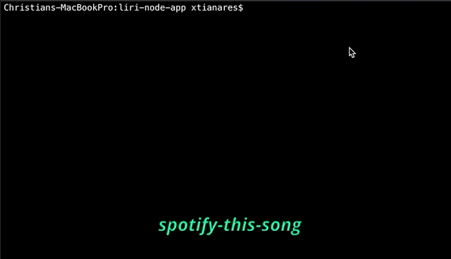
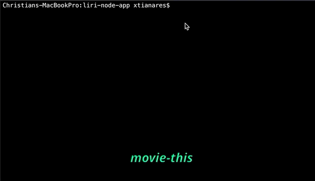
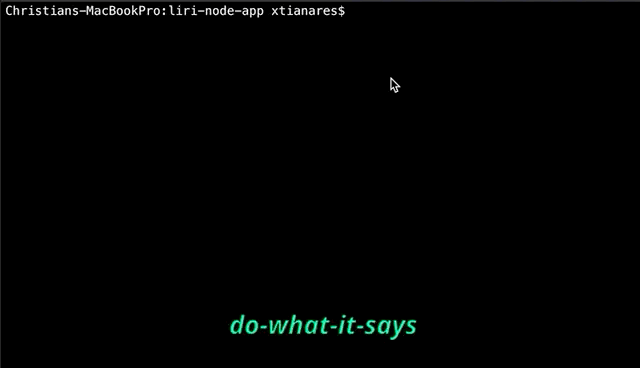

# LIRI Bot
A SIRI wanna be node application. This is a command line application that takes in user input (commands) and returns information about the command query (parameters) from the corresponding API.

### Commands and Parameters
**concert-this**:\
This command can be called like so "concert-this korn", this will return a list of events with details for the band called Korn.

**spotify-this-song**:\
This command will default to a predefined song if there's no other parameter included with it. You can use this command by calling for example "spotify-this-song in the end", this will return details about the song called In The End by Linkin Park.

**movie-this**:\
This command will default to a predefined movie if there's no other parameter included with it. You can use this command by calling for example "movie-this ted", this will return details about the movie Ted.

**do-what-it-says**:\
This will perform a predefined command based from the entry inside a file called random.txt

**Logging Command**\
Anything that you enter as a command will be logged into the log.txt file

### APIs
* http://www.artists.bandsintown.com/bandsintown-api/?locale=en
* https://developer.spotify.com/documentation/web-api/
* http://www.omdbapi.com/
